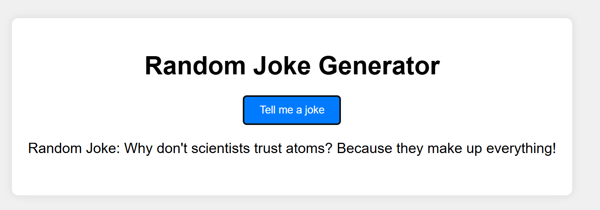

# Random Joke Generator



## Description

A fun project that generates a random joke each time you click a button. It uses a switch statement to categorize jokes into different types such as puns, knock-knock jokes, and random jokes.

## Installation

Instructions on how to install and set up your project.

```bash
# Clone this repository
git clone https://github.com/your-username/random-joke-generator.git

# Go into the repository
cd random-joke-generator

# Install dependencies
npm install
```
